# VocaCheck — UML Diagrams

All source files are stored as `.mermaid` files in this directory for version control.
GitHub renders the diagrams below natively.

---

## Architecture Overview

System components and their communication paths.

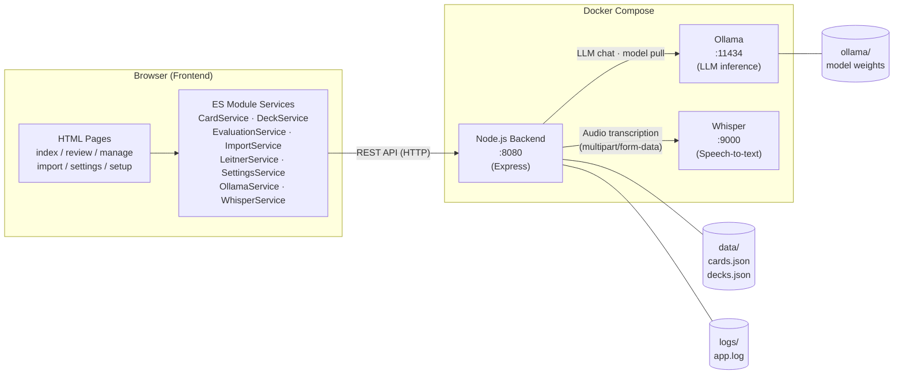

---

## Data Model

Entity-relationship diagram for the two persistent data types.

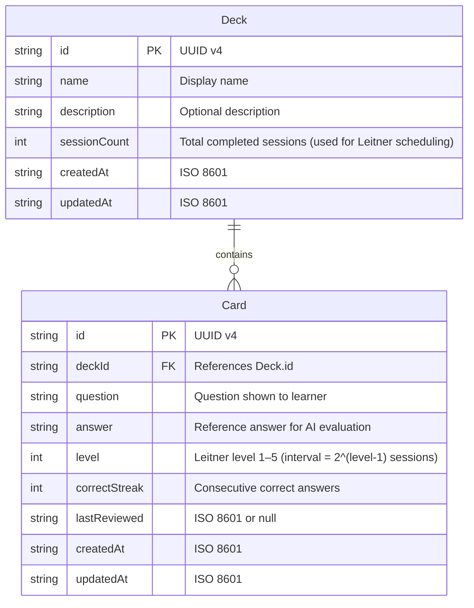

---

## Use Case Diagram

All user interactions supported by the application.

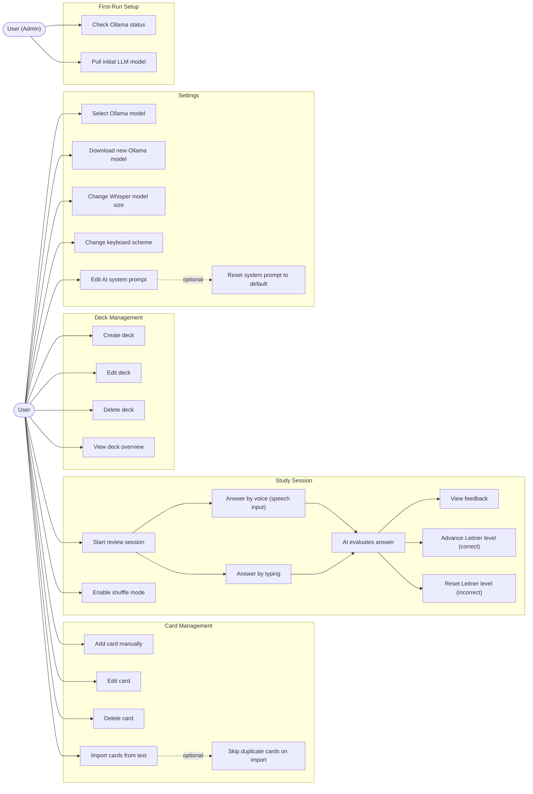

---

## Sequence: Card Review

Full data flow for a single review card — from voice input through AI evaluation to Leitner update.

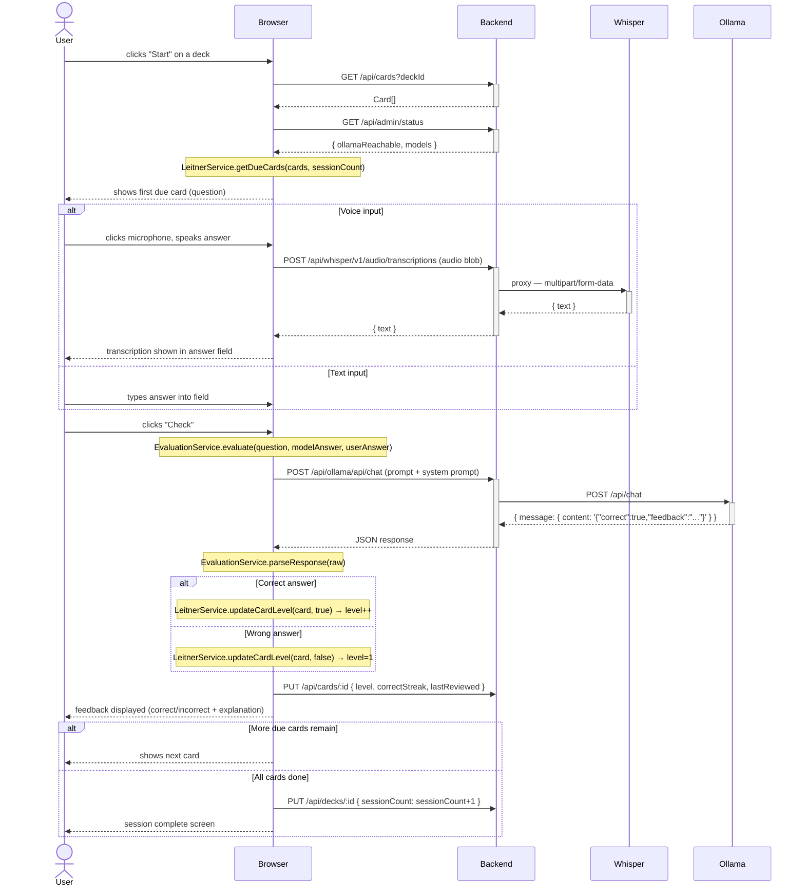

---

## Sequence: First-Run Setup

Flow when no LLM model is installed yet.

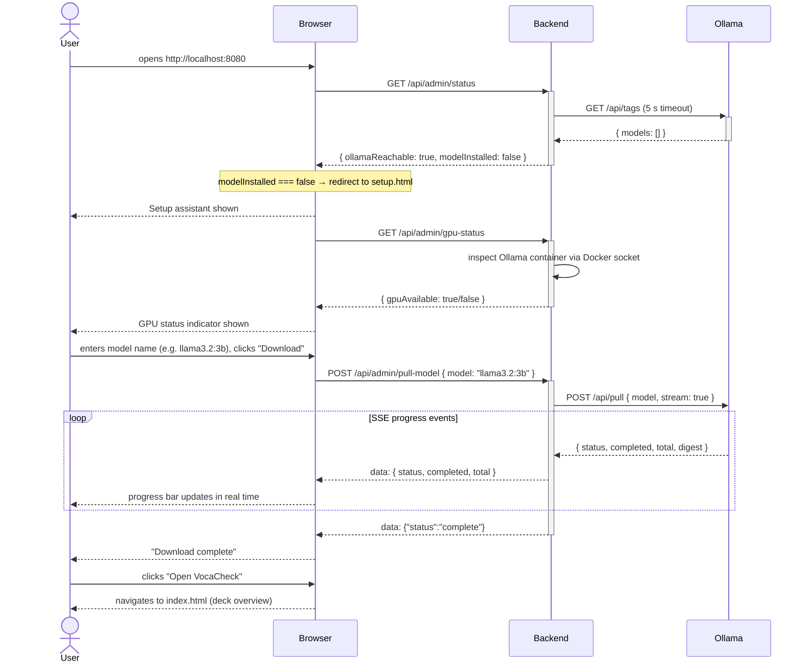

---

## Sequence: Whisper Model Change

Flow when the user changes the Whisper transcription model in Settings.

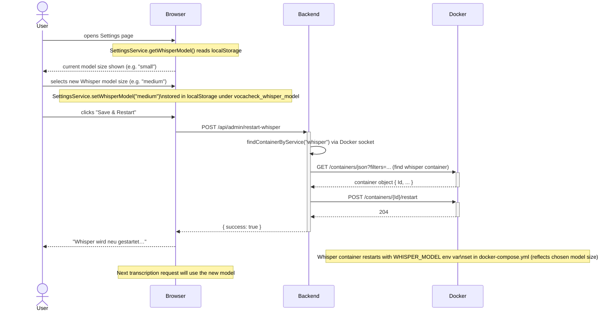

---

## Sequence: Import with Duplicate Filter

Flow for the text import feature including the optional duplicate-skipping logic.

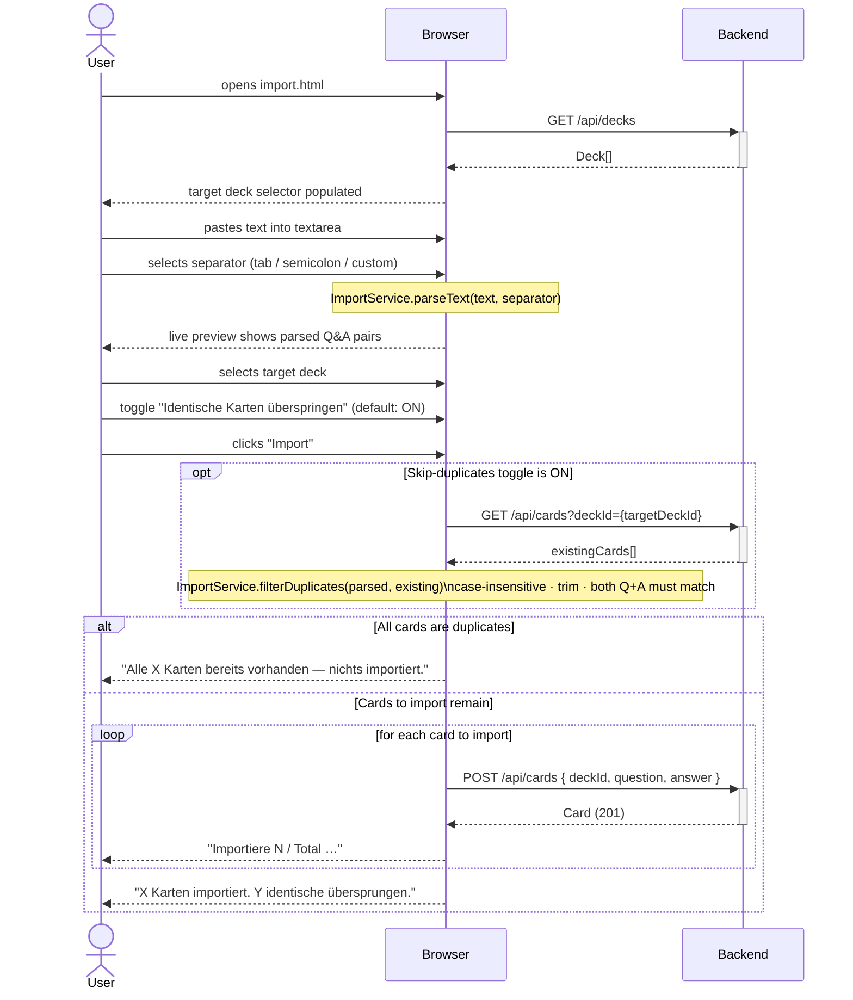

---

## Activity: AI Evaluation Logic

Decision flow for evaluating a user's answer via the LLM.

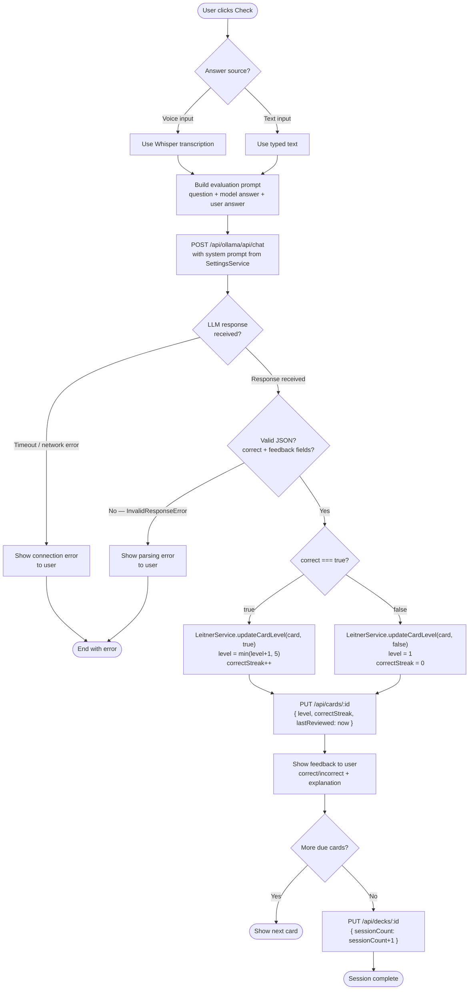

---

## Activity: GPU Detection

Decision flow for the `/api/admin/gpu-status` endpoint.

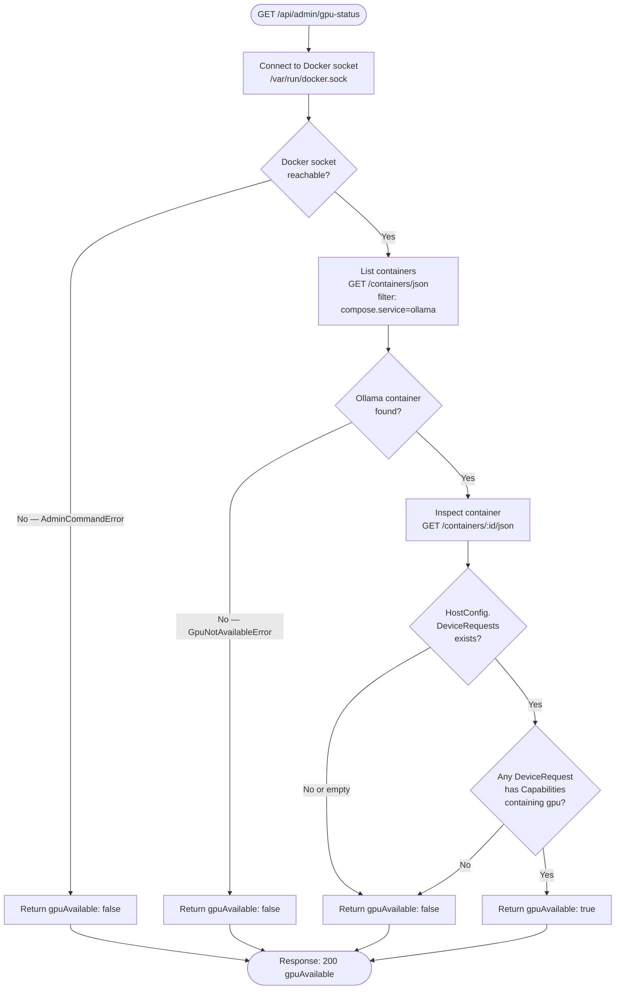

---

## Activity: Leitner Scheduling

How cards are selected and updated during a review session.

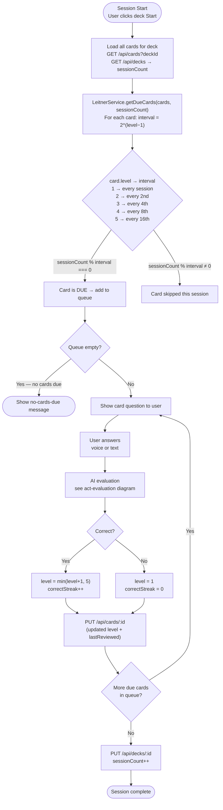

---

## Activity: Error Handling

How errors propagate through the Express backend.

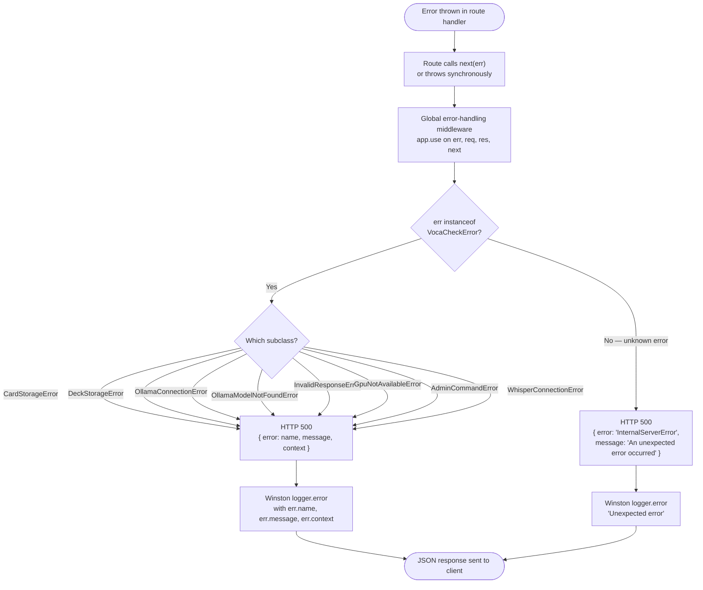
